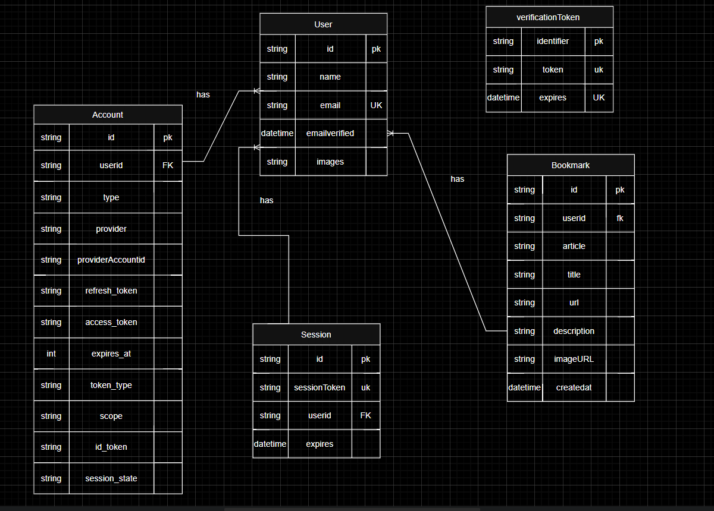

# Quick-Post Content Aggregator

Quick-Post is a multi-user, full-stack web content aggregation application that enables users to securely log in using magic links (via Supabase and NextAuth.js), browse articles from the Dev.to public API, and bookmark their favorite articles as bookmarks. Built with Next.js, TypeScript, Tailwind CSS, Prisma ORM, and a PostgreSQL database hosted on Supabase, the app includes secure backend API endpoints for managing user-specific bookmarks and guarantees each action—viewing, adding, or deleting a bookmark—is associated with the logged-in user's session. The front-end has a responsive, intuitive interface with dynamic authentication features and protected routes, and the back-end uses session-based access control to protect user data. With add-on features like toast notifications and optimistic UI updating, Quick-Post has a smooth and efficient reading and bookmarking experience.

## How to Run Locally

Provide clear, step-by-step instructions to get the project running.
1. Clone the repository: `git clone ...`
2. Install dependencies: `npm install`
3. Set up environment variables: Copy `.env.example` to `.env.local` and add your `DATABASE_URL` and `NEXTAUTH_SECRET`.
4. Run database migrations: `npx prisma migrate dev`
5. Run the development server: `npm run dev`

## Database Schema (ERD)

The Main Tables
1. Users Table (Like a list of all people using your app)
Stores: Each person's info (name, email, profile picture)
Important: Each user gets a unique ID number
Example: John (ID:1), Sarah (ID:2)

2. Accounts Table (How users log in)
Stores: Different login methods for each user (email, Google, etc.)
Connected to: Users table (shows which login belongs to who)
Example: John can log in with both email and Google

3. Sessions Table (Who's currently logged in)
Stores: Active logins (like when you stay logged in on your phone)
Connected to: Users table (which user is logged in)
Example: John is logged in on his phone and computer = 2 sessions

4. Verification Tokens Table (Security codes)
Stores: Temporary security links (like "magic links" sent to email)
Example: The special link sent to John's email to verify it's really him

5. Bookmarks Table (Saved articles)
Stores: Articles users save (title, link, description)
Connected to: Users table (who saved which articles)
Special rule: Can't save the same article twice
Example: John saves 3 programming articles

# Relation
1.One User → Many Accounts
You can have multiple ways to log in (email + Google)
Like having multiple keys to your house

2.One User → Many Sessions
Can be logged in on phone, laptop, tablet at same time
Like having multiple doors open to your account

3.One User → Many Bookmarks
Can save as many articles as you want
Like having a bookshelf where you keep favorite books

## Architectural Decisions & Trade-offs
#### Authentication: Magic Link

**Why magic link is a good choice for this app:**

- **User Experience (UX) & Simplicity:** Magic links offer a frictionless, passwordless authentication experience. Users don't need to remember complex passwords, reducing sign-up/login friction and potential for forgotten password issues. It's quick and intuitive.
- **Security (Reduced Password Risk):** By eliminating passwords, you remove the risk of password reuse across sites, weak passwords, or database breaches exposing user credentials. The "password" is a single-use, time-limited link sent directly to the user's verified email.
- **Accessibility:** It can be more accessible for users who struggle with traditional password management or complex forms.

**Security considerations:**

- **Email Compromise:** The primary security vulnerability shifts to the user's email account. If a user's email is compromised, an attacker could gain access to their account by requesting and using a magic link.

- **Phishing:** Users must be vigilant against phishing attempts. A malicious actor could send a fake magic link email to trick users into revealing their credentials or clicking a harmful link.

- **Link Expiration & Single Use:** To mitigate risks, magic links are typically single-use and have a short expiration time. This prevents replay attacks if a link is intercepted. NextAuth.js handles this by default.

- **Email Deliverability:** Relying solely on email for authentication means that issues with email deliverability (e.g., emails going to spam, delays) can directly impact the user's ability to log in. For production, a robust email sending service is crucial.

Here's an explanation of the architectural decisions and trade-offs made for your multi-user content aggregation web application:

### Architectural Decisions & Trade-offs

#### Authentication: Magic Link

**Why magic link is a good choice for this app:**

- **User Experience (UX) & Simplicity:** Magic links offer a frictionless, passwordless authentication experience. Users don't need to remember complex passwords, reducing sign-up/login friction and potential for forgotten password issues. It's quick and intuitive.
- **Security (Reduced Password Risk):** By eliminating passwords, you remove the risk of password reuse across sites, weak passwords, or database breaches exposing user credentials. The "password" is a single-use, time-limited link sent directly to the user's verified email.
- **Accessibility:** It can be more accessible for users who struggle with traditional password management or complex forms.

**Security considerations:**

- **Email Compromise:** The primary security vulnerability shifts to the user's email account. If a user's email is compromised, an attacker could gain access to their account by requesting and using a magic link.
- **Phishing:** Users must be vigilant against phishing attempts. A malicious actor could send a fake magic link email to trick users into revealing their credentials or clicking a harmful link.
- **Link Expiration & Single Use:** To mitigate risks, magic links are typically single-use and have a short expiration time. This prevents replay attacks if a link is intercepted. NextAuth.js handles this by default.
- **Email Deliverability:** Relying solely on email for authentication means that issues with email deliverability (e.g., emails going to spam, delays) can directly impact the user's ability to log in. For production, a robust email sending service is crucial.

#### Database & ORM: Prisma

**Why Prisma was chosen:**

- **Type Safety:** Prisma generates a type-safe client based on your database schema. This means compile-time checks for your database queries, significantly reducing runtime errors and improving developer confidence and productivity.
- **Excellent Developer Experience (DX):** Prisma provides an intuitive API for database interactions, a powerful migration system (`prisma migrate`), and a visual database browser (`prisma studio`). This streamlines development, schema evolution, and debugging.
- **Modern ORM Features:** It offers a robust query builder, connection pooling, and support for complex queries, making it efficient for interacting with PostgreSQL.
- **Schema Definition Language (SDL):** Prisma's schema file (`schema.prisma`) provides a clear, human-readable way to define your database structure and relationships, acting as a single source of truth.

**Limitations or trade-offs of your schema design:**

- **NextAuth.js Adapter Schema:** The `Account`, `Session`, and `VerificationToken` models are required by the NextAuth.js Prisma Adapter. While they provide a battle-tested and secure authentication system, they add tables that might seem verbose for a very simple custom authentication flow. However, the benefits of using a well-maintained auth library generally outweigh this.
- **`Bookmark` Model Data Storage:**

- **Trade-off:** The `Bookmark` model stores only essential metadata (`title`, `url`, `description`, `imageUrl`) from the Dev.to article, not the full article content.
- **Pros:** This keeps your database lean, avoids duplicating potentially large amounts of text, and ensures that the primary source of article content remains the Dev.to API.
- **Cons:** If the Dev.to API becomes unavailable or an article is removed/changed on their end, the bookmarked content might become stale or inaccessible beyond the stored metadata. Full-text search on bookmarked content would require fetching the original article or implementing a more complex indexing solution.

- **`onDelete: Cascade` for User Relationships:** For `Account`, `Session`, and `Bookmark` models, `onDelete: Cascade` is used. This means if a `User` record is deleted, all associated accounts, sessions, and bookmarks are automatically deleted. This is generally a desired behavior for personal data privacy and cleanup, but it's a powerful operation that needs to be handled carefully in application logic to prevent accidental data loss.

- **Compound Unique Constraint on `Bookmark`:** The `@@unique([userId, articleId])` constraint is a good design choice as it prevents a user from bookmarking the same article multiple times, ensuring data integrity.

Here's an explanation of the architectural decisions and trade-offs made for your multi-user content aggregation web application:

### Architectural Decisions & Trade-offs

#### Authentication: Magic Link

**Why magic link is a good choice for this app:**

- **User Experience (UX) & Simplicity:** Magic links offer a frictionless, passwordless authentication experience. Users don't need to remember complex passwords, reducing sign-up/login friction and potential for forgotten password issues. It's quick and intuitive.
- **Security (Reduced Password Risk):** By eliminating passwords, you remove the risk of password reuse across sites, weak passwords, or database breaches exposing user credentials. The "password" is a single-use, time-limited link sent directly to the user's verified email.
- **Accessibility:** It can be more accessible for users who struggle with traditional password management or complex forms.

**Security considerations:**

- **Email Compromise:** The primary security vulnerability shifts to the user's email account. If a user's email is compromised, an attacker could gain access to their account by requesting and using a magic link.
- **Phishing:** Users must be vigilant against phishing attempts. A malicious actor could send a fake magic link email to trick users into revealing their credentials or clicking a harmful link.
- **Link Expiration & Single Use:** To mitigate risks, magic links are typically single-use and have a short expiration time. This prevents replay attacks if a link is intercepted. NextAuth.js handles this by default.
- **Email Deliverability:** Relying solely on email for authentication means that issues with email deliverability (e.g., emails going to spam, delays) can directly impact the user's ability to log in. For production, a robust email sending service is crucial.

#### Database & ORM: Prisma

**Why Prisma was chosen:**

- **Type Safety:** Prisma generates a type-safe client based on your database schema. This means compile-time checks for your database queries, significantly reducing runtime errors and improving developer confidence and productivity.
- **Excellent Developer Experience (DX):** Prisma provides an intuitive API for database interactions, a powerful migration system (`prisma migrate`), and a visual database browser (`prisma studio`). This streamlines development, schema evolution, and debugging.
- **Modern ORM Features:** It offers a robust query builder, connection pooling, and support for complex queries, making it efficient for interacting with PostgreSQL.
- **Schema Definition Language (SDL):** Prisma's schema file (`schema.prisma`) provides a clear, human-readable way to define your database structure and relationships, acting as a single source of truth.

**Limitations or trade-offs of your schema design:**

- **NextAuth.js Adapter Schema:** The `Account`, `Session`, and `VerificationToken` models are required by the NextAuth.js Prisma Adapter. While they provide a battle-tested and secure authentication system, they add tables that might seem verbose for a very simple custom authentication flow. However, the benefits of using a well-maintained auth library generally outweigh this.
- **`Bookmark` Model Data Storage:**

- **Trade-off:** The `Bookmark` model stores only essential metadata (`title`, `url`, `description`, `imageUrl`) from the Dev.to article, not the full article content.
- **Pros:** This keeps your database lean, avoids duplicating potentially large amounts of text, and ensures that the primary source of article content remains the Dev.to API.
- **Cons:** If the Dev.to API becomes unavailable or an article is removed/changed on their end, the bookmarked content might become stale or inaccessible beyond the stored metadata. Full-text search on bookmarked content would require fetching the original article or implementing a more complex indexing solution.

- **`onDelete: Cascade` for User Relationships:** For `Account`, `Session`, and `Bookmark` models, `onDelete: Cascade` is used. This means if a `User` record is deleted, all associated accounts, sessions, and bookmarks are automatically deleted. This is generally a desired behavior for personal data privacy and cleanup, but it's a powerful operation that needs to be handled carefully in application logic to prevent accidental data loss.
- **Compound Unique Constraint on `Bookmark`:** The `@@unique([userId, articleId])` constraint is a good design choice as it prevents a user from bookmarking the same article multiple times, ensuring data integrity.

#### Data Fetching: SSR for Dashboard and Bookmarks Pages

The application uses Server-Side Rendering (SSR) for both the `/dashboard` and `/bookmarks` pages.

**Why SSR was chosen for both the dashboard and bookmarks pages:**

- **Performance (Initial Load):** For authenticated content, SSR provides a faster perceived initial load time. The server fetches all necessary data (Dev.to articles, user session, user bookmarks) and renders the complete HTML page before sending it to the client. This means the user sees the content immediately without waiting for client-side data fetching and rendering.
- **Security:** Sensitive operations like checking the user's session (`getServerSession`) and fetching user-specific data (bookmarks via Prisma) are performed securely on the server. This prevents exposing database queries or session logic directly to the client.
- **Reliability:** Data fetching occurs in a controlled server environment, which is generally more stable and less prone to network issues or client-side JavaScript errors that could disrupt data loading.
- **Simplicity in App Router:** In Next.js App Router, Server Components (which pages are by default) are designed for efficient server-side data fetching, making it a natural and idiomatic choice for pages that require initial data.

**Trade-offs (compared to a hypothetical CSR approach for these pages):**

- **Server Load:** Each request for these pages requires the server to perform data fetching and rendering, potentially increasing server load compared to a purely client-side approach where the server might only serve static HTML and the client fetches data.
- **Time To First Byte (TTFB):** If the data fetching (especially from external APIs like Dev.to) is slow, the server might take longer to generate the initial HTML, slightly increasing the TTFB. However, for most applications, the benefits of a fully rendered page outweigh this.

## AI Usage Log

BFor this project, I leveraged several AI tools to accelerate development and ensure best practices:

1. V0 by Vercel
Usage: I used V0 to generate the initial page structure and React components, including:
The page.tsx files for authentication flows
Basic page layouts and UI components
Routing structure for the Next.js application

2. ChatGPT (OpenAI)
Usage: I consulted ChatGPT for:
Generating the complete Prisma schema for NextAuth.js integration
Debugging database relationship issues
Best practices for implementing magic link authentication
Example Prompt: "Provide the complete Prisma schema configuration for NextAuth.js with Prisma adapter including User, Account, Session, and VerificationToken models"

3. DeepSeek
Usage: I utilized DeepSeek for:
Optimizing database queries
Analyzing performance considerations
Generating TypeScript type definitions

4. GitHub Copilot
Usage: I used Copilot for:
Code completion and suggestions throughout development
Generating utility functions and helper methods
Writing test cases and documentation